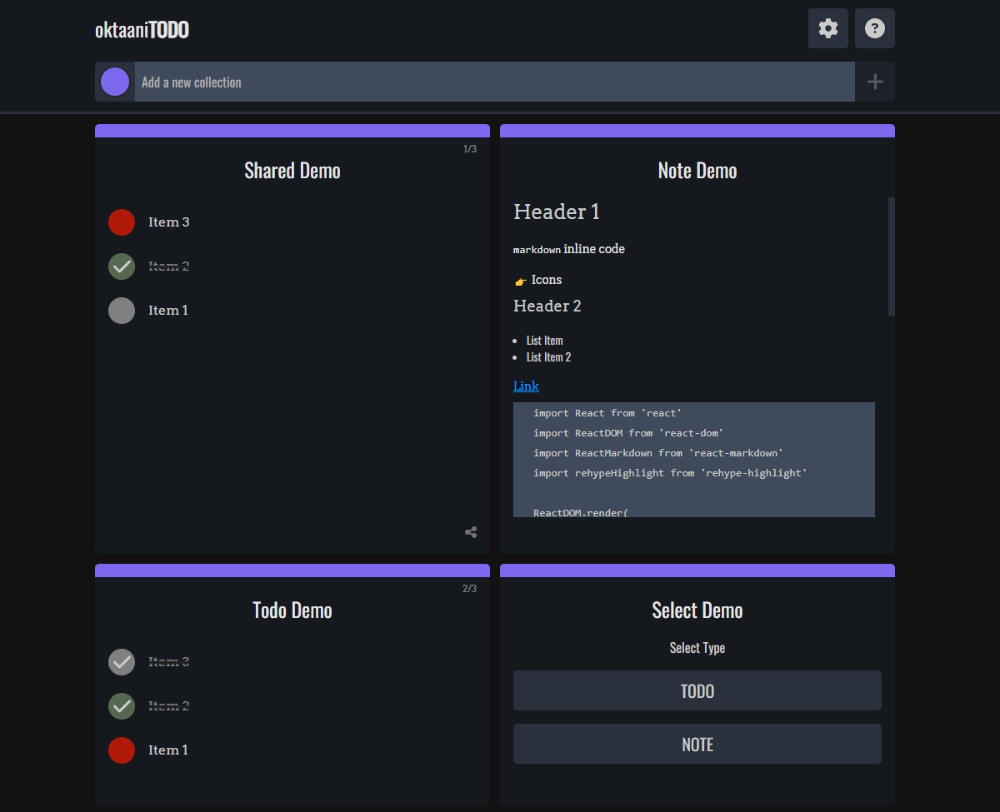

# oktaaniTODO

A simple To-Do app made with React. The app uses localStorage to store all necessary data.

User can edit list colors, list title, add a new todo item, mark items as done, clear done items, delete lists. User can also share created list to someone.

This app is using [oktaaniAPI](https://github.com/Epikle/oktaani-api).

## TODO

- Refactor code
- Style share fetch page

